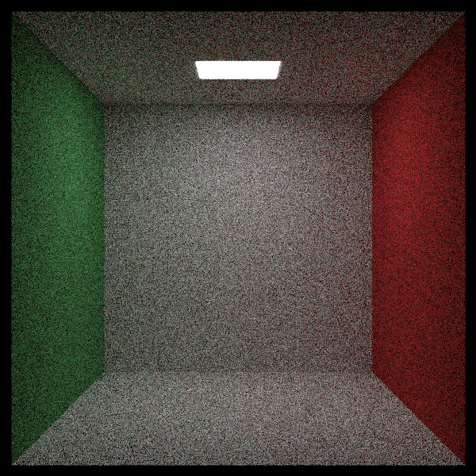
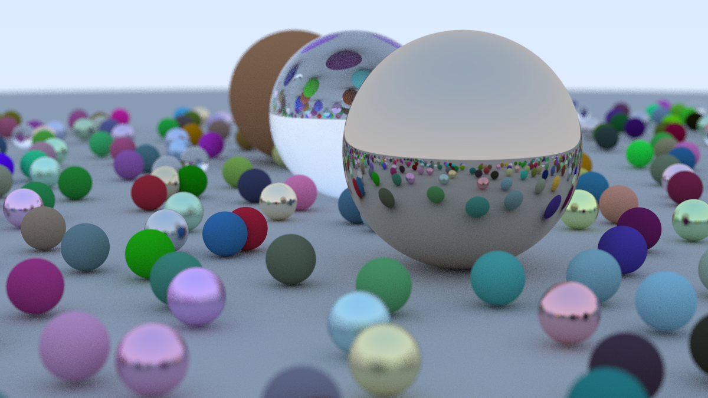
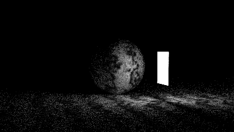
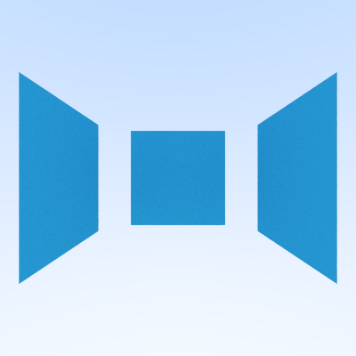

This is the source for a basic raytracer written in rust. It uses [Raytracing in one weekend](https://raytracing.github.io/books/RayTracingInOneWeekend.html) as a jumping-off point, but has some additional features like parallelization on the render loop, progress indicators, and cli flags to configure the render.

## Gallery

A starter scene is included in `src/main.rs`, and running `make render` will render it to `image.ppm` using
the default settings. Some examples of things that can be tweaked:
- Image resolution
- Aspect ratio
- Max recursion depth for ray scattering
- Amount of samples per pixel
- Camera focal disk

In the future, I plan to add:
- Scene deserialization from YAML/Binary format
- Other primitives
- Better texture support
